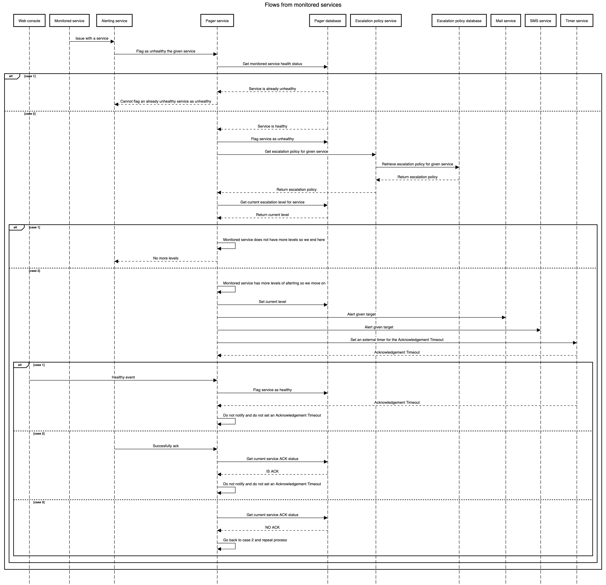

# Technical test pager

## About me

Hi! My name is Marc Posito and I've been a backend developer for 4 years now. I really enjoy coding and reading different topics about programming. Lately I've found the infrastructure world to be quite interesting despite not being an expert in the subject.

On a more personal level I really do like sports such as cycling and climbing and also tv shows (True Detective and The Sopranos are my favs).

Well, I am not going to overextend more so you will find in this readme all the necessary info to run the project and some explanations related to architecture and design decisions.

## Requirements

- `Node 16.14.0 or higher`

Remember you can check you node version with:

```sh
node -v
```

## How to run

After meeting the requirements in order to run the project or the unit tests we have to do the following:
First of all you have to perform an npm install with the following command:

```sh
npm install
```

If you want to run the project you have to execute the following command:

```sh
npm run start:dev
```

If you want to run the unit tests run the following command:

```sh
npm run test:unit
```

## The problem

In this technical test we face a complex system with multiple solutions. We have a pager service that has multiple services as inputs such as:

- Console web app
- Alerting service
- Timer service

And also some as outputs such as:

- Escalation policy service
- Persistence (pager database)
- Email service
- SMS service

Also, not all services are in or out, we have **Timer Service as an input and output service**.

In my opinion the difficulty lies in being able to design a system which can communicate to the other services without inconsistency issues in a scalable way.

After some careful I've done a diagram to have an overview of the system behaviour.



## Creating an architecture to be able to support the current system

In order to have a clear and reusable architecture to support the current system I've used the hexagonal architecture paradigm.

Basically we will structure our project in three layers:

- Application: Here we will have our bussines logic
- Domain: Here we will have our pure data models
- Infrastructure: Here we would have our frameworks, http libraries ...

The good thing about this architecture is that we are not coupling our data model with the database or other services, so if in the future we change our db from SQL to NoSQL we do not have to worry about that. That's why when we receive data from the DB or from a external service first we convert it to our domain model.

Also, being able to use the dependency inversion principle and injecting interfaces to our use cases makes the code more testable. We can just create mocks implementing the given interface and check the stubs are being called.

## Use cases

As you see under application/useCases we have four different files. I've structured the business logic the following way:

- **AcknowledgeTimeout**: This use case will only happen when a target is acknowledging through the pager web console. Here we will validate the service is not acknowledged yet and we will set it to acknowledged.
- **FlagServiceAsHealthy**: This use case will only happen when we receive the request to flag a service as healthy from the web console. We will validate the service was unhealthy and we will set it to healthy. I choosed not to validate the service is acknowledged because I thought that maybe an engineer could solve the issue without being notified.
- **FlagServiceAsUnhealthy**: This use case will only happen when we receive an alert through the alerting service. We will validate the service is healthy and after that we will notify the desired targets and set an acknowledge timeout.
- **SetNewAcknowledgeTimeout**: This use case is one of the most importants and will be the one that will be called repeatedly from the timer service every time we scale the policy to the next level. Basically we will validate that the service is unhealthy (if it was healthy we do not want to notify or scale), not acknowledged (if the service is already acknowledged we do not want to notify or scale to the next level) and that we have more scaling levels (if we do not have we cannot notify).

| Use case                 | Called from       | Validates                                                                                                        |
| ------------------------ | ----------------- | ---------------------------------------------------------------------------------------------------------------- |
| AcknowledgeTimeout       | Pager web console | If service is already acknowledged throws an exception                                                           |
| FlagServiceAsHealthy     | Pager web console | If service is already flagged as healthy throws an exception                                                     |
| FlagServiceAsUnhealthy   | Alerting service  | If service is already flagged as unhealthy throws an exception                                                   |
| SetNewAcknowledgeTimeout | Timer service     | If service is already flagged as healthy, acknowledged or does not have more alerting levels throws an exception |

## A bit about the infrastructure

I've created a infrastructure folder with the basical setup to run the project. I know it wasn't needed but I'd rather have it because I do not know if you'll need to run the project. I did not create any dockerfile or docker-compose (hope it wasn't necessary).

Related to persistence, apart from having the target as SMS or Email we could also have another filed called alterted which could be a boolean. So every time we alert a target we can flag that field and we can avoid sending multiple alerts to the same target.

## Multiple validators

You will see that we have multiple validators doing the same stuff. Now it may seem stupid but I think it is better to have different validators because the DTO's could grow apart from the others.
